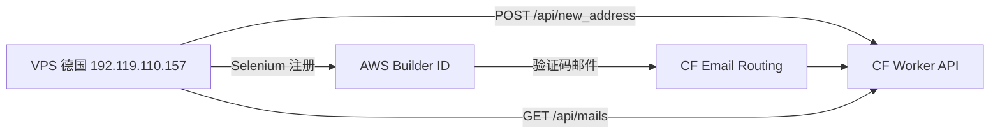

# 德国服务器 + Cloudflare 临时邮箱 部署指南

> 目录结构见 [README.md](README.md)。Windows 推荐 `deploy\bin\windows\`，VPS Shell 见 `deploy\vps\`，远程自动化见 `deploy\remote\steps\`。

## 环境信息

| 项 | 值 |
|---|---|
| 服务器 | `192.119.110.157` |
| SSH | `root@192.119.110.157:22` |
| 密钥 | `docs/toolan.pem` |
| 邮箱 API | `https://mx1.metoolbot.top`（VPS 自建，见 `deploy/services/vps-email/`） |
| 收信域名 | `metoolbot.top`（DNSPod 配置 MX 指向 `mx1.metoolbot.top`） |

## 零、无法 SSH 时：用 VPS 网页控制台安装

在服务商 **VNC / 网页终端** 中执行（整段复制）：

```bash
apt-get update -qq && apt-get install -y -qq git curl
git clone https://github.com/7836246/aws-builder-id.git /opt/aws-builder-id
bash /opt/aws-builder-id/deploy/vps/console-install.sh
```

或上传本仓库 `deploy/artifacts/aws-builder-id-bundle.zip` 到 `/root/` 后：

```bash
apt-get install -y unzip
unzip -o /root/aws-builder-id-bundle.zip -d /opt/aws-builder-id
bash /opt/aws-builder-id/deploy/vps/console-install.sh
```

脚本会自动安装 Chrome/Python、配置 `authorized_keys`，便于之后本机 SSH。

---

## 一、恢复 SSH（当前阻塞项）

从本机连接时在 **KEX 阶段被断开**（`Connection aborted`），尚未到公钥认证。请在 VPS 商控制台用 **VNC/串口** 登录后检查：

```bash
# 查看 SSH 日志
journalctl -u ssh -n 50 --no-pager
tail -50 /var/log/auth.log

# 确认公钥（将本机 toolan.pem 对应公钥加入）
mkdir -p /root/.ssh && chmod 700 /root/.ssh
echo '你的ssh-rsa公钥一行' >> /root/.ssh/authorized_keys
chmod 600 /root/.ssh/authorized_keys

# 若被 fail2ban 封禁
fail2ban-client status sshd
fail2ban-client unban --all

# 防火墙
ufw allow 22/tcp
ufw status
```

本机生成公钥：

```powershell
ssh-keygen -y -f $env:USERPROFILE\.ssh\toolan_deploy.pem
```

Windows 密钥权限：

```powershell
Copy-Item docs\toolan.pem $env:USERPROFILE\.ssh\toolan_deploy.pem -Force
icacls $env:USERPROFILE\.ssh\toolan_deploy.pem /inheritance:r
icacls $env:USERPROFILE\.ssh\toolan_deploy.pem /grant:r "${env:USERNAME}:(F)"
```

## 二、部署临时邮箱（推荐：VPS 自建 mx1）

已在项目中提供与 [cloudflare_temp_email](https://github.com/dreamhunter2333/cloudflare_temp_email) **API 兼容** 的实现：`deploy/services/vps-email/app.py`。

### 2.1 DNSPod 记录

详见 [docs/DNS邮箱配置.md](../docs/DNS邮箱配置.md)：

- **A** `mx1` → `192.119.110.157`
- **MX** `@` → `mx1.metoolbot.top`（优先级 10）

### 2.2 服务器安装邮箱服务

```bash
bash /opt/aws-builder-id/deploy/services/vps-email/install.sh
```

### 2.3 配置说明

`config/config.yaml`：

```yaml
email:
  worker_url: "https://mx1.metoolbot.top"
  domain: "metoolbot.top"
```

---

## 二（备选）、部署临时邮箱（Cloudflare）

若不想在 VPS 上跑 Postfix，可使用 [cloudflare_temp_email](https://github.com/dreamhunter2333/cloudflare_temp_email) + **Cloudflare Email Routing**。

### 2.1 域名接入 Cloudflare

1. 登录 [Cloudflare](https://dash.cloudflare.com) → 添加站点 `metoolbot.top`
2. 将 DNSPod 的 NS 改为 Cloudflare 分配的两条 NS（当前为 `eleanore.dnspod.net` / `word.dnspod.net`）
3. 等待生效

### 2.2 部署 Worker

```powershell
cd d:\my-project\aws-builder-id
npx wrangler login
.\deploy\cloudflare\setup_email.ps1 -Domain metoolbot.top -WorkerSubdomain temp-email-api
```

或按官方文档：https://temp-mail-docs.awsl.uk

### 2.3 配置 Email Routing

1. Cloudflare → `metoolbot.top` → **Email** → **Email Routing** → Enable
2. **Routing rules** → Catch-all → **Send to a Worker** → 选择已部署的 Worker
3. 确认 MX 记录为 `*.route.mx.cloudflare.net` 等 CF 记录

### 2.4 验证邮箱 API

```powershell
$body = '{"name":"test123"}'
Invoke-RestMethod -Uri "https://temp-email-api.metoolbot.top/api/new_address" -Method Post -Body $body -ContentType "application/json"
```

应返回 `jwt` 与 `address`。

## 三、部署注册工具到 VPS

SSH 恢复后：

```powershell
cd d:\my-project\aws-builder-id
.\deploy\push_and_deploy.ps1
```

或手动：

```bash
ssh -i ~/.ssh/toolan_deploy.pem root@192.119.110.157
git clone https://github.com/7836246/aws-builder-id.git /opt/aws-builder-id
cd /opt/aws-builder-id && bash deploy/vps/server-setup.sh
```

编辑 `/opt/aws-builder-id/config/config.yaml`（或复制 `config/config.production.yaml`）：

```yaml
email:
  worker_url: "https://temp-email-api.metoolbot.top"
  domain: "metoolbot.top"
region:
  current: "germany"
  use_proxy: false   # 德国 VPS 可直接用本机 IP
browser:
  headless: true
```

## 四、跑通完整注册流程

```bash
cd /opt/aws-builder-id
source .venv/bin/activate
python src/runners/main.py
# 或
bash deploy/vps/run-register.sh
```

成功账号写入 `accounts.jsonl`。

## 五、架构示意



## 六、常见问题

| 现象 | 处理 |
|------|------|
| SSH Connection aborted | 控制台解封 IP、检查 authorized_keys |
| 创建邮箱 HTTP 4xx/5xx | 检查 worker_url、Worker 是否部署、D1 迁移 |
| 收不到验证码 | Email Routing Catch-all、MX 是否生效 |
| Chrome 启动失败 | `google-chrome --version`，更新 undetected-chromedriver |
| 代理失败退出 | 生产环境设置 `use_proxy: false` |
